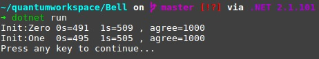

# Quantum Bell - The magic of Quantum Entanglement

The goal of this project is to make both a [Quantum Superposition](https://en.wikipedia.org/wiki/Quantum_superposition) and a [Quantum Entanglement](https://en.wikipedia.org/wiki/Quantum_entanglement)!

It uses [Q#](https://docs.microsoft.com/en-us/quantum/quantum-qr-intro?view=qsharp-preview) and yeah, Quantum programming is not what you're thinking, it's really complex and we cannot do a web API with it... At least not by now! :sparkling_heart:

### So, how can I run a Quantum program in my machine?

It's pretty simple! You have to have the [.NET Core SDK](https://www.microsoft.com/net/learn/get-started) for you platform, and maybe, [VSCode](https://code.visualstudio.com/) can help, because it's the only editor to support Q# nowadays, but it's not mandatory!
After getting this guys, you can clone the Microsoft's Quantum Development Kit sample, to make sure your machine supports [Qubits'](https://en.wikipedia.org/wiki/Qubit) operations and that your .NET Core is ready to run Q#, you can simply run `git clone https://github.com/Microsoft/Quantum.git`, you can enter the `Quantum/Samples/Teleportation` folder, (with something like a `cd Quantum/Samples/Teleportation`),

* **TIP**: If you open this project with the VSCode text editor, you'll be prompted to install the Q# extension, it's pretty amazing so I recommend it,

And them, simply run `dotnet run` to see the magic, if everything goes fine, you're done!

And to run this guy right here, you can just run `git clone https://github.com/Horaddrim/quantum-bell`, enter the folder -> `cd quantum-bell`, and run `dotnet run`! I think it will be more amazing if you see the source code in the `Bell.qs` file :wink:

### So what is happening? I just see a bunch of numbers with no sense at all!

It was a simple example of two of my favorite concepts in quantum mechanics! The first one is the [Quantum Superposition](https://en.wikipedia.org/wiki/Quantum_superposition) and the other one is [Quantum Entanglement](https://en.wikipedia.org/wiki/Quantum_entanglement)! Inside the file `Bell.qs` I'll explain the **how** to do this, but in concept, I'll make a `qubit` be either in the 0 and in the 1 state, and after that, I'll make two qubits entangled, so, whatever happen to one qubit happen to the other one! So, statically, in second 0 (`0s` in the image), and second 1 (`1s`), the results will **ALWAYS BE 50/50** so, all the times there will be a qubit with state equals 1 and one with state 0, and this will happen all the time, but the `agree` result is just the check, to see if one of the qubits is equal to the another after I set one of them to a random state, the other one is been set too, so, if you ever get the `agree` output coming of different from 1000, for real, it's something wrong, because you've just break the quantum mechanics laws.
